## Task 2: Create database and table in your MySQL server
#### 2.1 Create a new database named website.
- ```
  CREATE DATABASE website;
  ```
  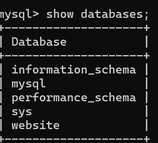
#### 2.2 Create a new table named member, in the website database
- ``` 
  create table website.member(
    -> id bigint auto_increment primary key,
    -> name varchar(255) not null,
    -> username varchar(255) not null,
    -> password varchar(255) not null,
    -> follower_count int unsigned not null default 0,
    -> time datetime not null default current_timestamp
    -> );
    ```
  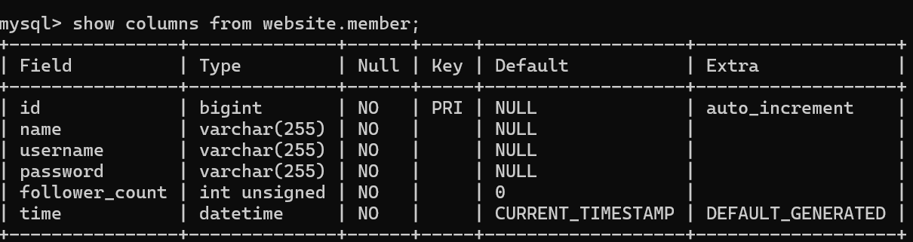
---
## Task 3 : SQL CRUD
#### 3.1 INSERT a new row to the member table where name, username and password must be set to test. INSERT additional 4 rows with arbitrary data.
- ``` 
  insert into website.member(name,username,password)values('test','test','test'); 

  insert into website.member(name,username,password)values
  -> ('Lily','lily','lily123'),
  -> ('Amy','amy','amy123'),
  -> ('John','john','john123'),
  -> ('Kelly','kelly','kelly123');
  ```
  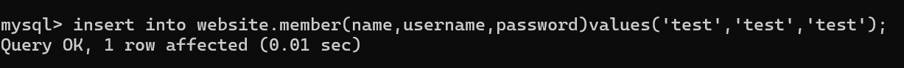
  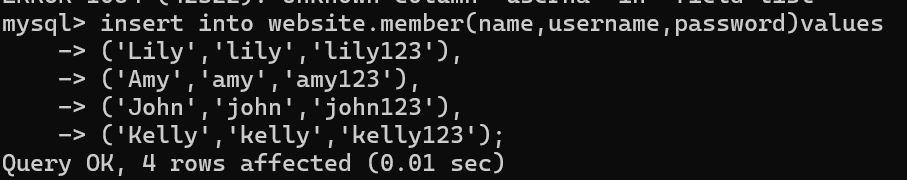
#### 3.2 SELECT all rows from the member table.
- ```
  select * from website.member;
  ```
  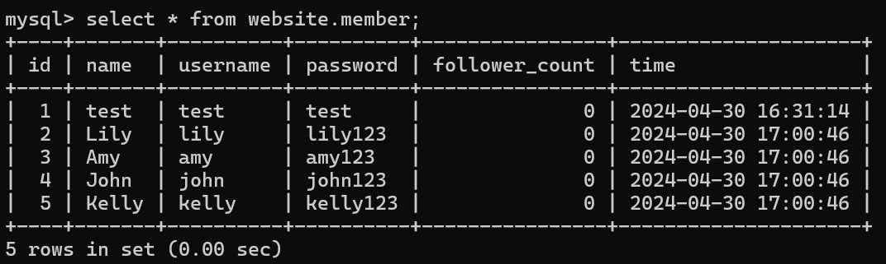
#### 3.3 SELECT all rows from the member table, in descending order of time.
- ```
  select * from website.member
    -> order by time desc;
  ```
  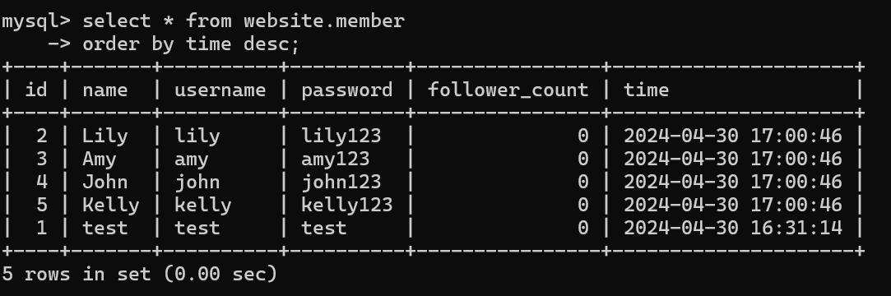
#### 3.4 SELECT total 3 rows, second to fourth, from the member table, in descending order of time. Note: it does not mean SELECT rows where id are 2, 3, or 4.
- ```
   select * from website.member order by time desc limit 3 offset 1;
   ```
  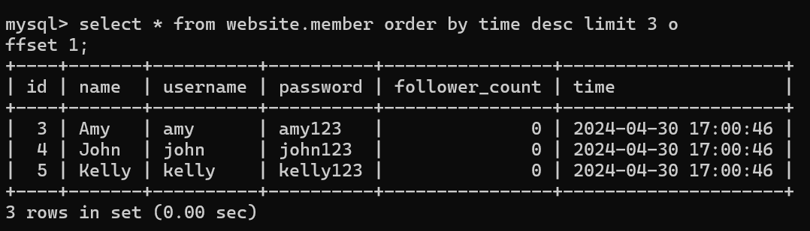
#### 3.5 SELECT rows where username equals to test.
- ```
  select * from website.member
    -> where username = 'test';
  ```
  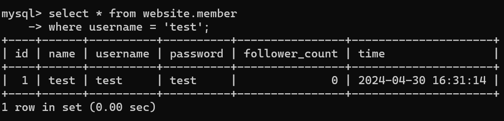
#### 3.6 SELECT rows where name includes the es keyword.
- ```
   select * from website.member where name like '%es%';
   ```
  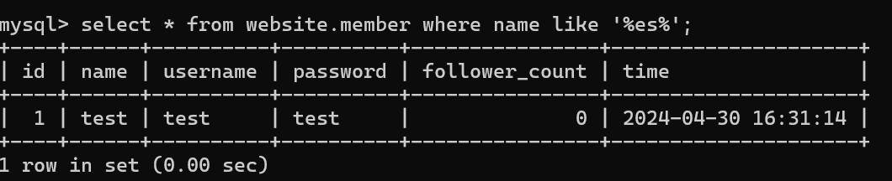
#### 3.7 SELECT rows where both username and password equal to test.
- ```
   select * from website.member where username = 'test' and password = 'test';
   ```
  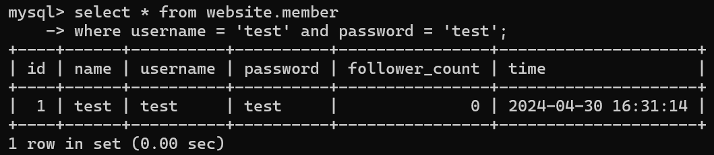
#### 3.8 UPDATE data in name column to test2 where username equals to test.
- ```
  update website.member
    -> set name = 'test2'
    -> where username= 'test';
  ```
  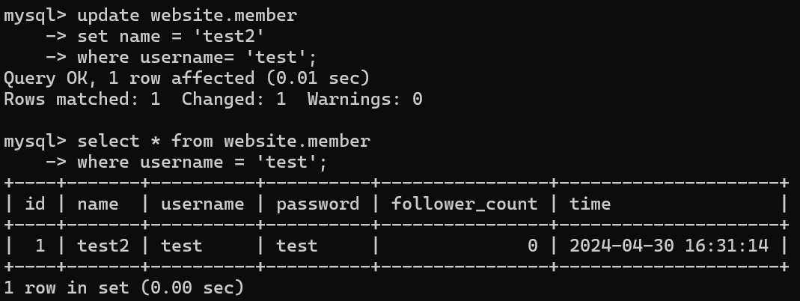
---
## Task 4 : SQL Aggregation Functions
#### 4.1 SELECT how many rows from the member table.
- ```
   select count(*)
    -> from website.member;
  ```
  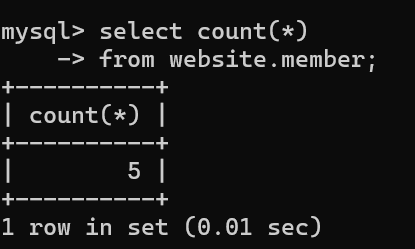
#### 4.2 SELECT the sum of follower_count of all the rows from the member table.
- ```
  select sum(follower_count) from website.member;
  ```
  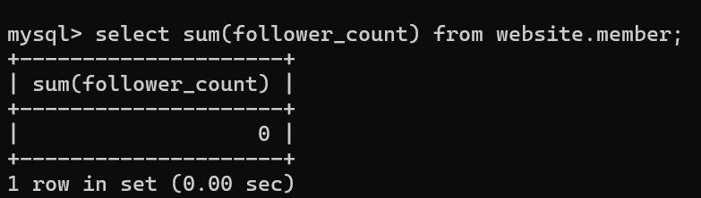
#### 4.3 SELECT the average of follower_count of all the rows from the member table.
- ```
   select avg(follower_count) from website.member;
  ```
  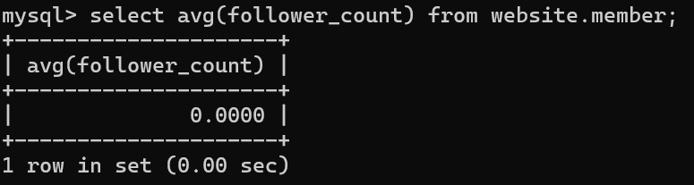
#### 4.4 SELECT the average of follower_count of the first 2 rows, in descending order of follower_count, from the member table.
- ```
   select avg(follower_count)
    -> from(
    -> select follower_count
    -> from website.member
    -> order by follower_count desc
    -> limit 2
    -> ) as subquery;
    ```
  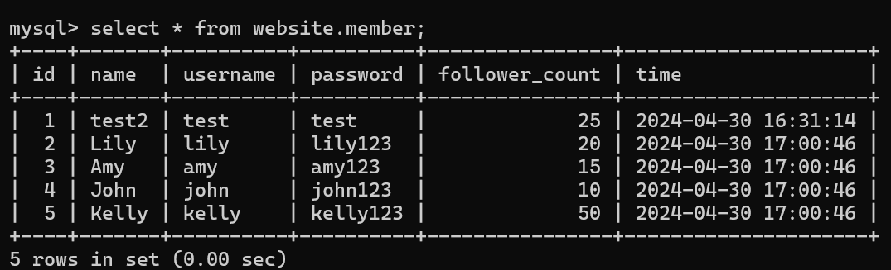
  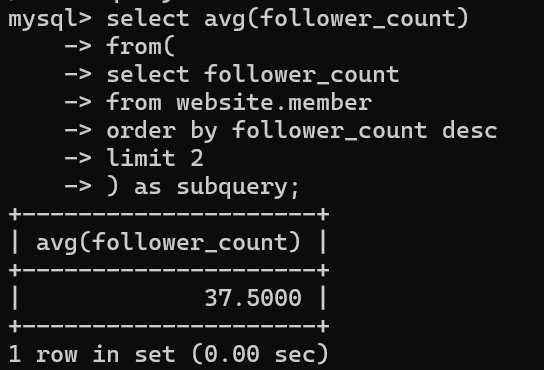
---
## Task 5 : SQL JOIN
####  5.1 Create a new table named message, in the website database.
- ```
   create table website.message(
    -> id bigint auto_increment primary key,
    -> member_id bigint not null,
    -> foreign key(member_id) references member(id),
    -> content varchar(255) not null,
    -> like_count int unsigned not null default 0,
    -> time datetime not null default current_timestamp
    -> );
    ```
  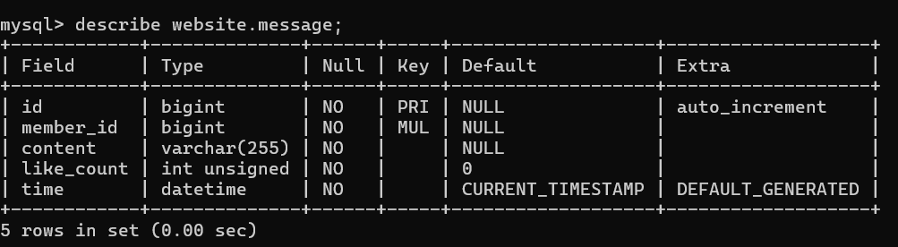
#### 5.2 SELECT all messages, including sender names. We have to JOIN the member table to get that.
- ```
   select message.*, member.name as sender_name
    -> from website.message
    -> join website.member on message.member_id = member.id;
    ```
  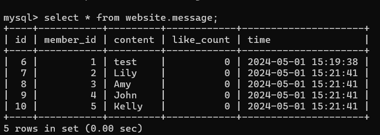
  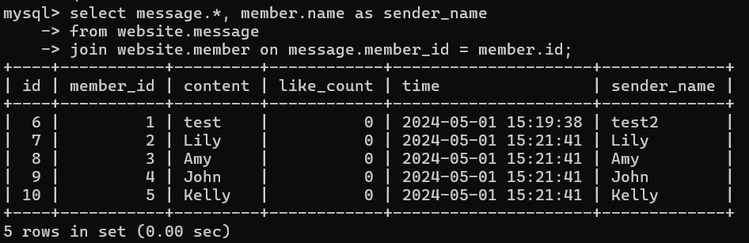
####  5.3 SELECT all messages, including sender names, where sender username equals to test. We have to JOIN the member table to filter and get that.
- ```
  select message.*, member.name as sender_name
    -> from website.message
    -> join website.member on message.member_id = member.id
    -> where member.username = 'test';
    ```
  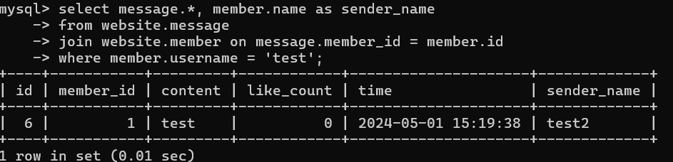
####  5.4 Use SELECT, SQL Aggregation Functions with JOIN statement, get the average like count of messages where sender username equals to test.
- ```
   select avg(message.like_count) as avg_like_count
    -> from website.message
    -> join website.member on message.member_id = member.id
    -> where member.username = 'test';
    ```
  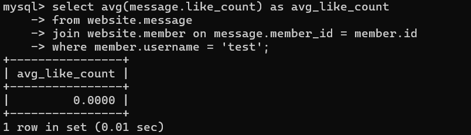
####  5.5 Use SELECT, SQL Aggregation Functions with JOIN, get the average like count of messages GROUP BY sender username.
- ```
  select avg(message.like_count) as avg_like_count, member.username
    -> from website.message
    -> join website.member on message.member_id = member.id
    -> group by member.username;
    ```
  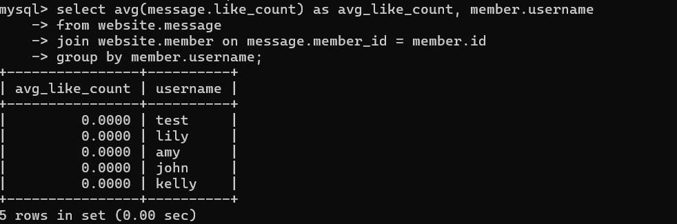